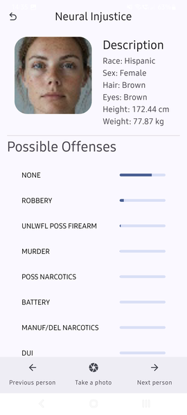

# Neural Injustice | Biometric Feature Correlation & AI Bias Research

An experimental research platform and mobile interface designed to investigate the technical feasibility and inherent ethical limitations of utilizing facial biometrics for probabilistic behavioral risk assessment. This project serves as a technical case study for evaluating model performance on high-volume, non-ideal datasets and analyzing algorithmic bias in computer vision.

> **Research Disclaimer:** This is a strictly experimental Proof of Concept (PoC). The system is designed to highlight the challenges of biometric predictive modeling and the technical hurdles of dataset sanitization, rather than to provide actionable or deterministic classification.

### 🖥️ Interface & System State
*Initial UI state awaiting video stream input.*

### 🧪 Inference Bias & Error Analysis

#### Sample A: Feature Extraction Baseline (High-Risk Probability Artifact)

#### Sample B: Demographic Misclassification (Type I Error / Lighting Noise)

#### Sample C: Control Group Verification (Standard Variance)

#### Sample D: Generalization Failure (Type II Error / Dataset Under-representation)

## 🏗️ Architecture & Context
*High-level system design and execution model.*

* **Objective:** Implementation of a research-oriented biometric pipeline that offloads heavy ML inference to dedicated high-performance hardware to ensure low-latency client-side interactions.
* **Architecture Pattern:** Client-Server model. The backend is optimized for inference, utilizing the Apple Neural Engine via M3-silicon to handle multi-stage neural network pipelines.
* **Data Flow:**
    1. **Acquisition:** Frontend imagery capture and Base64 serialization via React Native.
    2. **Normalization:** Server-side ROI (Region of Interest) extraction for faces and eyes using OpenCV.
    3. **Augmentation:** Generation of a 6-variant input tensor to increase model resilience against environmental variance.
    4. **Inference:** Execution of specialized mini-models via TensorFlow/Keras to generate probabilistic predictions.

## ⚖️ Design Decisions & Trade-offs
*Technical justifications for architectural and ML-centric choices.*

* **Inference Strategy: Multi-Model Decomposition**
    * **Context:** Training a single monolithic model for all biometric traits proved hardware-prohibitive and resulted in suboptimal accuracy across heterogeneous features.
    * **Decision:** Implementation of an ensemble of 6-7 specialized "mini-models" targeting individual facial characteristics.
    * **Rationale:** Specialized models achieved significantly higher precision and allowed for parallelized inference, optimizing the utilization of the M3 hardware acceleration.
    * **Trade-off:** Accepted increased complexity in the deployment pipeline and cross-model state management.

* **Data Engineering: High-Volume Preprocessing**
    * **Context:** The raw dataset required aggressive expansion to 200,000 images via augmentation to ensure neural network convergence.
    * **Decision:** Development of a high-throughput preprocessing pipeline capable of preparing the entire dataset in 15 minutes.
    * **Rationale:** Rapid dataset preparation allowed for significantly faster iteration cycles during hyperparameter tuning and model validation.
    * **Trade-off:** Accepted a 10% structural data loss due to strict OpenCV detection thresholds, ensuring that only high-fidelity features entered the training phase.

## 🧠 Engineering Challenges
*Analysis of non-trivial technical hurdles and research findings.*

* **Challenge: OpenCV Spatial De-duplication in Live Inference**
    * **Problem:** During real-time processing, OpenCV frequently detected multiple overlapping bounding boxes for a single face ("ghosting"), leading to duplicate entries and inconsistent inference results.
    * **Implementation:** Developed a spatial filtering layer to consolidate overlapping ROIs based on intersection-over-union thresholds. The logic ensures that each unique face is mapped to a single identity, preventing redundant processing.
    * **Outcome:** Stabilized live detection and ensured that inference scores remain consistent per subject, even under varying angles or lighting.

* **Challenge: Maximizing Feature Recovery in Noisy Data**
    * **Problem:** A significant portion of the development phase was dedicated to tuning the image processing pipeline, as standard OpenCV cascades frequently failed to detect critical facial ROIs (like eyes) in low-quality samples.
    * **Implementation:** Fine-tuned the detection parameters and implemented fallback augmentation strategies to recover as much usable data as possible without introducing artificial noise.
    * **Outcome:** Successfully utilized 90% of the candidate dataset while maintaining the strict anatomical alignment required for the CNN input layers.

## ⚖️ Ethics & Responsible AI (Case Study Analysis)

This project is a technical demonstration of how bias manifests in machine learning models when trained on sensitive biometric data. The following ethical considerations were central to the analysis:

* **The Fallacy of Physiognomy:** It is explicitly acknowledged that visual traits have no empirically proven causal link to criminal behavior. The system's predictions are a reflection of biases inherent in training datasets, not objective reality.
* **Algorithmic Bias Mitigation:** Preprocessing steps (grayscale/normalization) were implemented to reduce the model's reliance on skin tone. However, the experiment proves that significant bias remains a risk in predictive biometrics.
* **Social Impact Assessment:** The results are presented as raw probability distributions to highlight the high level of uncertainty and the risk of false positives, which could lead to unjust profiling if used outside a research context.

## 🛠️ Tech Stack & Ecosystem
* **Backend Core:** Python (FastAPI), Uvicorn
* **ML Runtime:** TensorFlow, Keras, scikit-learn, Keras-Tuner
* **Computer Vision:** OpenCV (ROI extraction, spatial normalization)
* **Mobile Interface:** React Native (Expo), TypeScript
* **Data Science:** Pandas, NumPy

## 🧪 Quality & Standards
* **Testing Strategy:** Verification of visual trait accuracy using standardized public figure datasets to assess cross-domain generalization.
* **Observability:** Real-time monitoring of training stability via Loss-over-Epoch and Accuracy-over-Epoch visualizations to detect early-stage overfitting.
* **Engineering Principles:** Strict Separation of Concerns between the CV preprocessing layer, ML inference runtime, and the API gateway.

## 🙋‍♂️ Authors

**Kamil Fudala**

- [GitHub](https://github.com/FreakyF)
- [LinkedIn](https://www.linkedin.com/in/kamil-fudala/)

**Jan Chojnacki**

- [GitHub](https://github.com/Jan-Chojnacki)
- [LinkedIn](https://www.linkedin.com/in/jan-chojnacki-772b0530a/)

**Jakub Babiarski**

- [GitHub](https://github.com/JakubKross)
- [LinkedIn](https://www.linkedin.com/in/jakub-babiarski-751611304/)

## ⚖️ License

This project is licensed under the [MIT License](LICENSE).
